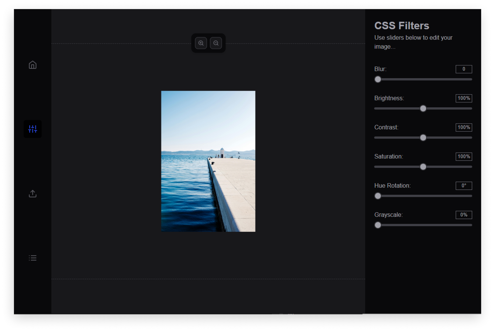

# RCIE (React CSS Image Editor)



## Introduction
This project is an image editing app built with React and CSS, utilizing the canvas element for photo manipulation. The application features a drag-and-drop file upload with a `Dropzone` component for easy image imports. After uploading, users can manage their images in the `FilelistPanel`, where they can view, select, and remove files.

Users can edit their images on a customizable `Canvas` component, applying CSS filters like blur, brightness, contrast, and saturation. The `FilterPanel` allows real-time adjustments, making the editing process interactive. The app maintains an organized state using React hooks, ensuring a smooth user experience.

The **Navbar** component enhances navigation within the app, providing buttons for returning to the home view, toggling filters, uploading new images, and displaying the file list. Each button is designed for quick access, improving the overall user interface.

## Features
- Drag-and-Drop Image Upload
- Save to LocalStorage
- Filelist Display
- Image Display (Canvas Element)
- Image Filtering (CSS Filters)
- Zoom-in and Zoom-out
- Download Edited Image
- Remove files
- Responsive Design

## Technologies Used
- **React**: A JavaScript library for building user interfaces.
- **Vite**: A build tool that provides a fast development environment for modern web applications.
- **Sass**: A preprocessor that adds functionality to CSS, allowing for nested rules and variables.
- **PropTypes**: A library for type-checking React props.
- **React Dropzone**: A library for handling drag-and-drop file uploads.
- **React Icons**: A library that provides customizable icons for React applications.
- **ESLint**: A static code analysis tool for identifying problematic patterns in JavaScript code.

## Setup

1. **Clone the repository**:

  ```bash
  git clone https://github.com/yaneczq/react-img-editor.git
  ```

2. Navigate to the project directory:
   
  ```
  cd react-img-editor
  ```

3. Install dependencies:
   
  ```
  npm install
  ```

4. Start the development server:
  ```
  npm run dev
  ```

## License

This project is licensed under the MIT License. See the [LICENSE](./LICENSE) file for details.
